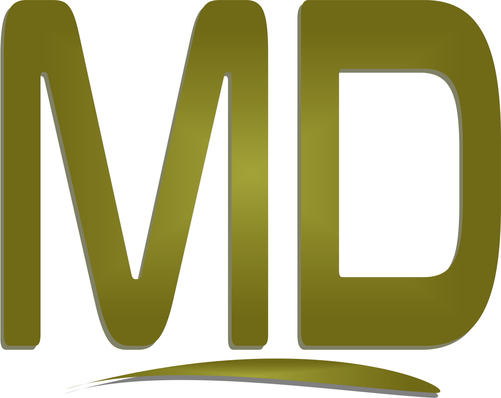

# MD PHP Framework
Mini Framework para desenvolvimento de App/Api com Back-End PHP e Banco de Dados Mysql. 
Front-End com PHP Twig Templete engine e/ou Vuejs, com HTML, CSS/Sass.

* Get Started --> [Documentação](https://messiasdias.github.io/md-php-framework-project/)
* Mantido por --> [Messias Dias](https://github.com/messiasdias)

